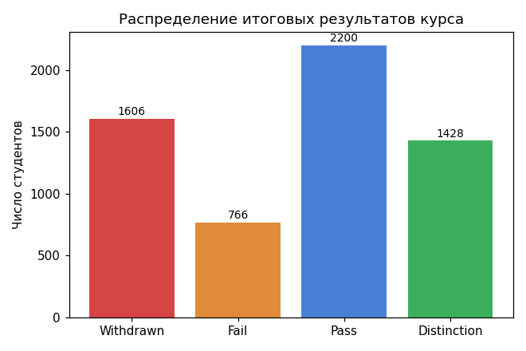
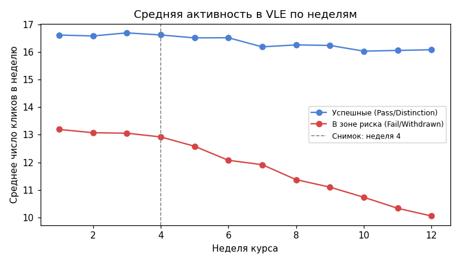
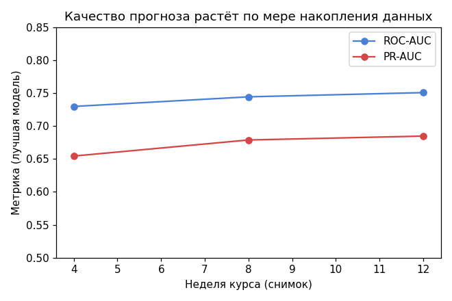

# 🎓 Student Risk Prediction — раннее прогнозирование риска отчисления

Проект в области **EdTech / Learning Analytics**: модель предсказывает, какие
студенты онлайн-курса рискуют получить неудовлетворительный результат
(Fail/Withdrawn), причём **как можно раньше** — уже на 4-й неделе курса, —
чтобы у преподавателя оставалось время на вмешательство.

## Проблема и бизнес-ценность

Отток студентов на онлайн-курсах — дорогая проблема: институт теряет деньги
за незавершённые курсы, а студент — время и мотивацию. Если преподаватель
узнаёт о риске только по итоговой оценке, вмешиваться уже поздно.

Этот проект строит модель, которая на **4-й, 8-й и 12-й неделе** курса даёт
risk score по каждому студенту, используя только те данные, которые реально
доступны к этому моменту (без утечки данных из будущего). Показано, как
растёт точность прогноза по мере накопления данных — это ключевой
аналитический вывод проекта.

## Данные

Используется синтетический датасет, воспроизводящий структуру и статистические
свойства реального **OULAD (Open University Learning Analytics Dataset)**:
демография студентов, активность в виртуальной учебной среде (клики по неделям),
баллы за задания, итоговый результат курса.

Реальный OULAD не выложен на GitHub/PyPI и скачивается отдельным архивом с
[analyse.kmi.open.ac.uk](https://analyse.kmi.open.ac.uk/open_dataset) — см.
инструкцию по переключению на реальные данные в
`data/generate_synthetic_data.py`.

## Структура проекта

```
student_risk_prediction/
├── data/
│   ├── generate_synthetic_data.py   # генератор синтетических данных (схема OULAD)
│   └── raw/                          # сгенерированные CSV
├── src/
│   ├── data_processing.py            # построение snapshot без data leakage
│   ├── features.py                   # feature engineering
│   ├── train_model.py                # обучение и сравнение моделей
│   └── explain.py                    # интерпретируемость (SHAP)
├── app/
│   └── streamlit_app.py              # дашборд для преподавателя
├── models/                            # сохранённые модели (.pkl)
├── reports/
│   └── metrics_by_week.json          # метрики по неделям
└── requirements.txt
```

## Подход

1. **Snapshot-фрейминг** — для недель 4/8/12 строится отдельная таблица
   признаков, где используются только клики и оценки, накопленные *до этой
   недели включительно*. Это защищает от классической ошибки — использования
   финальных оценок для "раннего" прогноза.
2. **Модели** — Logistic Regression (baseline), Random Forest, LightGBM;
   сравниваются по ROC-AUC, PR-AUC, recall/precision для класса риска
   (recall важнее: лучше ложно предупредить, чем пропустить).
3. **Интерпретируемость** — SHAP объясняет как глобальную важность признаков,
   так и вклад каждого признака в прогноз конкретного студента.
4. **Дашборд** — Streamlit-приложение показывает список студентов в зоне
   риска на выбранной неделе, с порогом отсечения и объяснением прогноза.

## Ключевые графики EDA

**Распределение исходов курса** — дисбаланс классов, который учитывается при обучении (`class_weight="balanced"`):



**Активность в VLE по неделям** — у студентов из группы риска активность резко падает уже после 4-й недели, тогда как у успешных остаётся стабильной. Это главный сигнал, который использует модель:



**Рост качества прогноза по мере накопления данных**:



## Результаты

| Неделя | Лучшая модель | ROC-AUC | PR-AUC | Recall (риск) |
|--------|--------------|---------|--------|----------------|
| 4      | Logistic Regression | 0.730 | 0.654 | 0.654 |
| 8      | Logistic Regression | 0.744 | 0.679 | 0.659 |
| 12     | Logistic Regression | 0.751 | 0.685 | 0.661 |

Точность растёт по мере накопления данных о студенте, но уже на 4-й неделе
модель улавливает больше половины случаев риска — при этом остаётся
6-8 недель на то, чтобы преподаватель успел вмешаться.

Топ-факторы риска (по SHAP): низкий средний балл за задания, малое число
кликов в учебной среде, отсутствие формального образования, повторные
попытки прохождения курса.

## Как запустить

```bash
pip install -r requirements.txt

# 1. Сгенерировать данные
python data/generate_synthetic_data.py

# 2. Обучить модели для недель 4/8/12
cd src && python train_model.py && cd ..

# 3. Запустить дашборд
streamlit run app/streamlit_app.py
```

## Возможные улучшения

- Подключить реальный OULAD и сравнить метрики с синтетикой
- Добавить FastAPI-сервис + Docker для полноценного деплоя модели
- Time-to-event моделирование (когда именно студент, скорее всего, отчислится)
- A/B-тест: реально ли вмешательство преподавателя снижает отток у
  предсказанной группы риска
